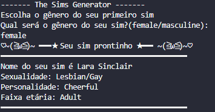

# Generator TS4 

## O que é?

Um script feito em python com o intuito de gerar aleatoriamente combinações de perfis para sims (personagem do jogo), desde atributos como nome e sobrenome, obtidos de uma vasta, mas limitada lista em JSON, até a personalidade central, estilo de vida do Sim. 
Foi um projeto muito divertido de fazer, onde consegui materializar visualmente como seria cada sim, seguindo o perfil indicado ***(Homem/Mulher)***.

## Tech Stack

*PYTHON* <br>
*Json* <br>
*Streamlit* <br>

## Screenshots



## Instalação

```bash
git clone https://github.com/MariaSinesio/family-generator-ts4.git
```

```bash
python script.py
```
OU

```bash
streamlit run interface.py
```

## Próximos passos...

- Fazer deploy do projeto
- Adicionar mais chaves, atribbutos ao gerador
- Corrigir problemas internos

## LICENSE

[MIT](https://choosealicense.com/licenses/mit/)

## Contribuição

Aberto para contribuição em breve..


